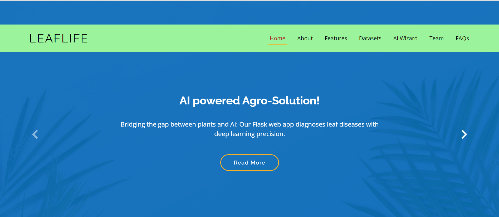
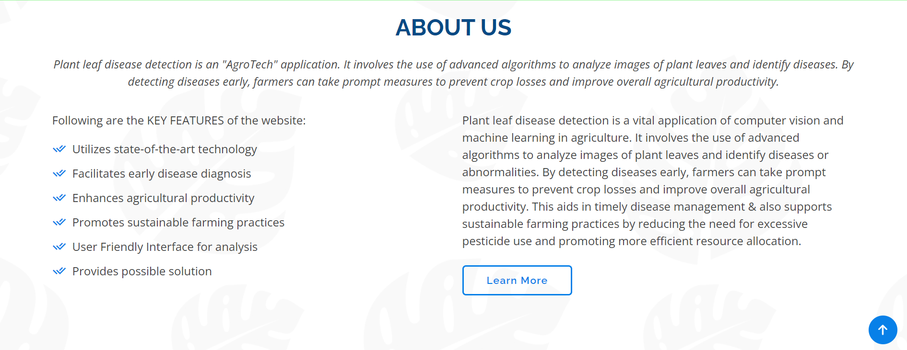
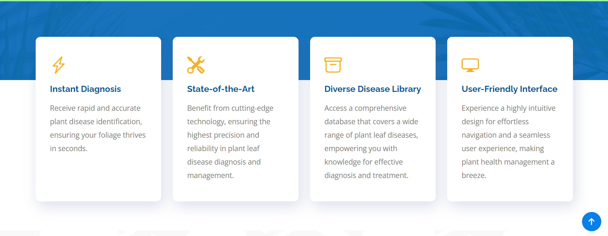
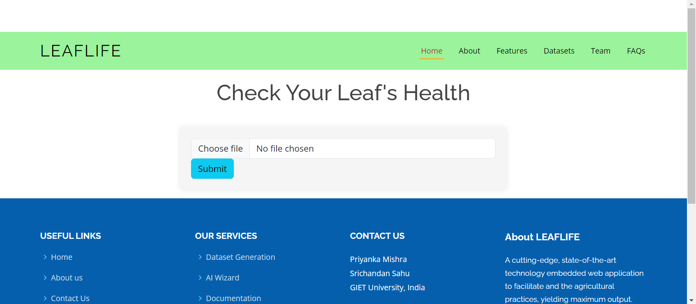
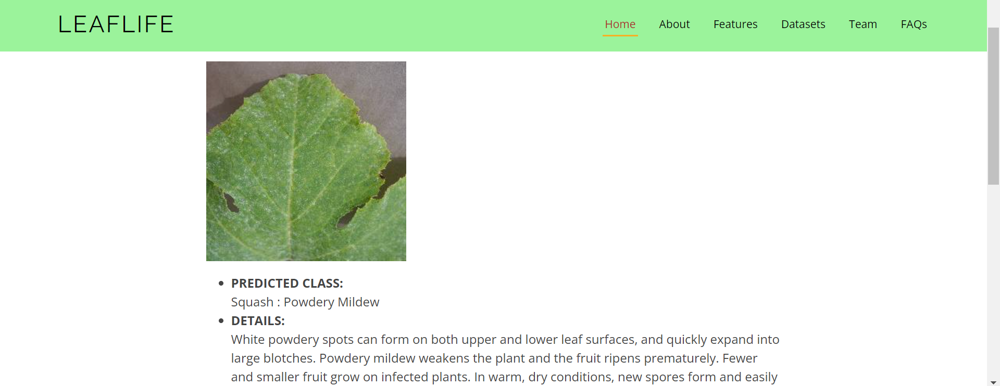

# Leaflife

Leaflife is a user-friendly Web Application built using Flask, HTML, CSS, JS and Bootstrap templates integrated with the innovative convolutional neural network (CNN)-based model designed for the detection and classification of plant leaf diseases. Developed with a comprehensive dataset of 22,911 images encompassing 40 distinct classes across 12 different plant species, Leaflife aims to offer accurate identification and diagnosis of various leaf ailments. This project leverages deep learning techniques to aid farmers and botanists in early disease detection, enabling timely interventions and potentially preventing widespread crop damage.

## Dataset

The dataset utilized for training the Leaflife model comprises meticulously collected images encompassing 40 diverse classes of plant leaf diseases across a spectrum of 12 plant species. With 22,911 images carefully curated and labeled, this dataset offers a robust foundation for training and validating the CNN model. The extensive variety of diseases and plant species covered in the dataset facilitates a comprehensive understanding and classification of various leaf ailments, ensuring the model's accuracy and versatility.


## Model

The model powering Leaflife is a convolutional neural network (CNN) architecture fine-tuned and trained on the collected dataset of 22,911 images. Leveraging deep learning techniques and neural network layers, the model has been optimized for accurate classification of 40 distinct classes of plant leaf diseases across 12 different plant species. Through its training process, the model has learned intricate patterns and features crucial for identifying and diagnosing leaf diseases, thereby demonstrating promising results in disease detection and classification tasks.

## Web Application Features

- User-friendly interface for uploading and analyzing plant leaf images to check leaf's health.
- Integration with the Leaflife CNN model for accurate disease detection.
- Responsive design using Bootstrap for compatibility across various devices.

## Web App Samples

### HOMEPAGES





### AI WIZARD




## Installation

If you want to use Leaflife, you can follow these steps to get started:

1. Clone the repository:

   ```bash
   git clone https://github.com/PriyankaPMishra/leaflife.git
   
2. Move inside the Folder
   ```bash
   cd leaflife
   cd FlaskApp
   
3. Install dependencies
   ```bash
   pip install -r requirements.txt
